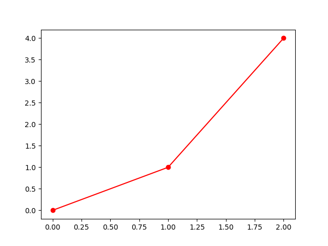

# Yazılıma Giriş

## Bölüm 1: Python Temelleri

```python
print("Merhaba Dünya!\n Ne Bekliyordun ki?")
```
## Bölüm 2: Matematiksel Formüller

**İntegral Örneği:**

$$ \int_{0}^{1} x^2 \,dx = \left. \frac{x^3}{3} \right|_{0}^{1} = \frac{1}{3} $$


## Bölüm 3: Grafik

```python
# Koordinat çizimi
import matplotlib.pyplot as plt
plt.plot([0,1,2], [0,1,4], 'ro-')
plt.savefig("../images/coord_plot.png")  # Önemli!
```


*(Resimler de ekleyebilirsiniz)*
